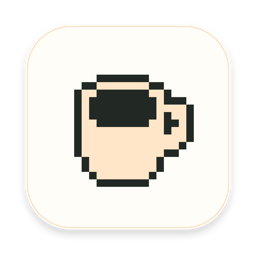
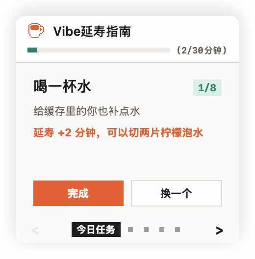

<h1>
  
  HealthyVibe / Vibe延寿指南
</h1>

这是一款为 Vibe coding 程序员准备的小工具，适合那些经常对 AI 说：

> “你先写着，我等一下回来。”

但最后发现自己一直坐在电脑前的人。


<p align="center">
  
</p>


本项目的灵感来自：[程序员延寿指南](https://github.com/geekan/HowToLiveLonger) 项目。

当你把 prompt 交给 Claude Code 或 Codex，等 AI 写代码的时候，它偶尔会提醒你做一点很短的健康任务：喝口水、远眺一下、起身活动、动动肩颈或手腕。

**AI 在工作，碳基生物也可以顺手续一会儿命。**

它还支持组建小队，可以看到小队成员的排行榜，争取每天都成为朋友间最会续命的人吧。


## 安装

在终端输入一行命令，拉取安装包自动安装：

```bash
brew install --cask xfey/tap/healthyvibe
```

安装完成后，打开 `HealthyVibe.app`。它不会弹出一个大窗口，只会出现在 macOS 菜单栏里。

更新也可以使用一行命令：

```bash
brew update && brew upgrade --cask healthyvibe
```

如果弹出通知说明“拒绝终端修改您的APP”，请点击允许，因为我们通过终端进行更新应用。如果拒绝，您也可以在如下链接手动下载 APP 然后重新安装：

[Release](https://github.com/xfey/HealthyVibe/releases)


## 怎么用

第一次打开后，点击菜单栏里的 HealthyVibe 图标。

在设置页里连接你正在使用的 agent：

- Claude Code
- Codex

连接后，重启对应的 agent 会话。之后每当你提交 prompt，HealthyVibe 就会通过系统通知提醒你做一个小任务。（需要允许它弹出通知的权限）

## 小队

小队不需要账号或者登录这些麻烦的事儿。

点击 `创建` 会得到一个 6 位邀请码。把这个号码发给朋友，朋友输入同一串邀请码并点击 `加入`，就会进入同一个排行榜。

成为朋友里面续命最多的人吧。


## 隐私

HealthyVibe 只关心一件事：你什么时候提交了 prompt。

它不会保存你的 prompt、代码、diff、文件路径或命令内容，也不会上传这些内容。它只通过一个 hook，当发现你提交 prompt 之后，就给你发提醒。它不记录任何你的任务数据。

它只在本地记录你每一天的延寿时长，以便于你通过日历查看，或者通过小队 PK 排行。

所有代码完全开源，如果你不放心的话，也可以看一遍代码。以及，欢迎大家一起贡献代码、优化 APP。


## 卸载

如果你已经养成了健康的生活习惯，想要卸载应用，也只需要一行命令就可以：

```bash
brew uninstall --cask healthyvibe
```

## 自己编译或修改

如果你需要自己编译、修改代码并进行部署，可以查看：

- `DEVELOPMENT.md`：本地开发、项目结构和调试说明
- `DISTRIBUTION.md`：签名、公证、打包和 Homebrew Cask 发布流程
- `relay/`：小队排行榜服务的接口说明和参考实现


## 致谢

感谢那些愿意把等待 AI 的几十秒，换成喝水、远眺和起身活动的你，是你让你的身体变得更健康了。

## License

MIT
